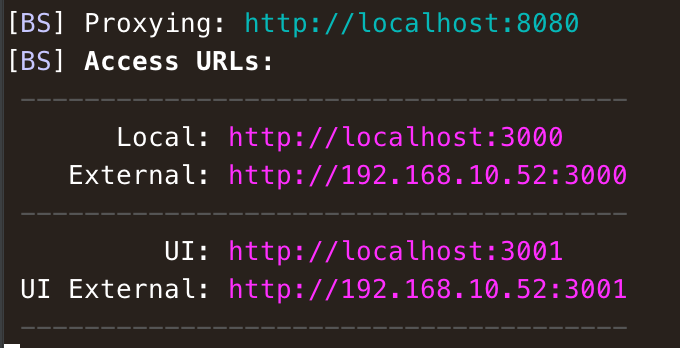

# Vue.js starter template

A bare-bones starter-template to get your hands dirty with awesome [Vue.js](https://github.com/vuejs/vue) library.

Built with:
* [Vue.js 2](https://github.com/vuejs/vue)
* [Vue Router 2](https://github.com/vuejs/vue-router)
* [Vue Resouce](https://github.com/vuejs/vue-resource)
* [Babel](https://babeljs.io/)
* [BrowserSync](https://www.browsersync.io/)
* [ESLint](http://eslint.org/)
* [Webpack](https://webpack.github.io/)
* [SASS](http://sass-lang.com/)
* [JSONPlaceholder](http://jsonplaceholder.typicode.com/)
* [Bootstrap 4](https://v4-alpha.getbootstrap.com/)
* [Font Awesome](http://fontawesome.io/)

## Demo
Navigate to [http://vue-starter.testi.in/](http://vue-starter.testi.in/) and see the awesomeness IRL :bowtie:

## Getting started

Clone the repo & run `npm install` from the project root

## Available commands

```shell
npm start
```

Runs the Webpack module-bundler, starts watching for changes & launches the BrowserSync server to [http://localhost:3000](http://localhost:3000) (it's possible to change the port from `package.json` config-section).

**Note!** Webpack handles all the reloading stuff while BrowserSync just proxies the default webpack-port (`8080`) giving the possibility to connect to dev-server from multiple devices: 



```shell
npm run lint:js
```

Lints javascript-files inside `/src` directory

```shell
npm run build
```

Runs the webpack module-bundler with production-settings (compress etc.) and builds the project to `/build` directory.
